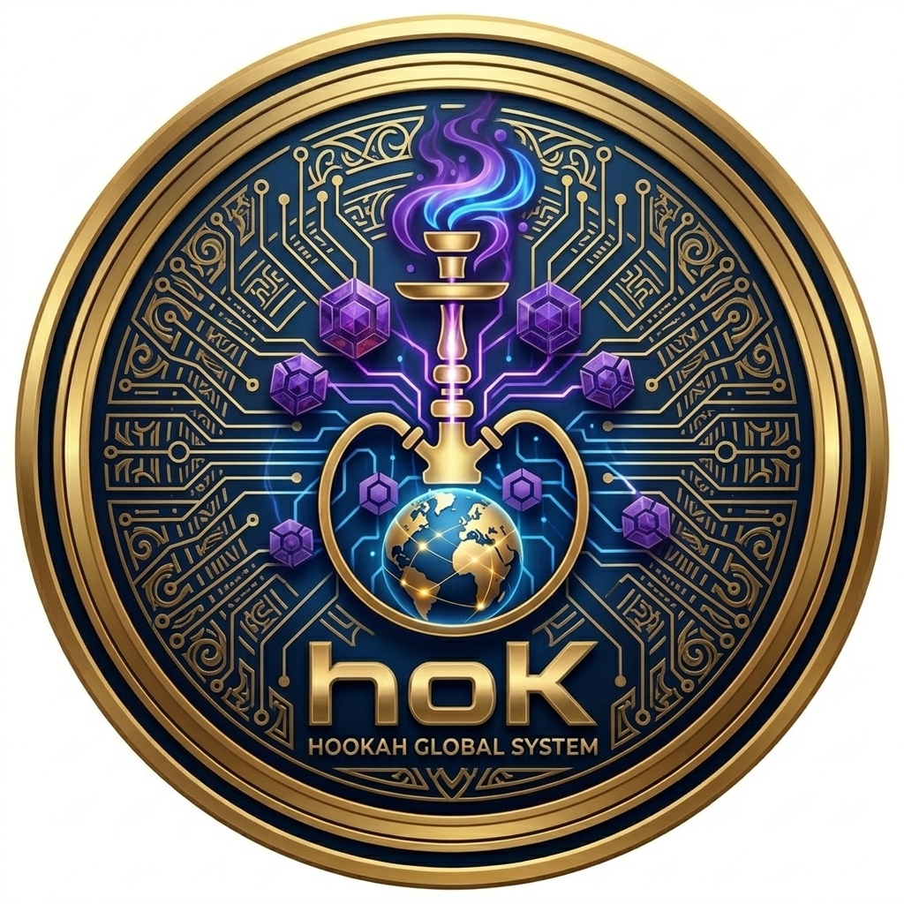

# HOOKAH GLOBAL SYSTEM (HOK)

The world's first DAO that merges hookah culture with Web3 economy.

## About

**HOOKAH GLOBAL SYSTEM (HOK)** is a decentralized autonomous organization (DAO) built on the TON blockchain, dedicated to revolutionizing the global hookah industry through blockchain transparency, community governance, and shared rewards.

## Mission

To build the world's largest global community for hookah enthusiasts, powered by blockchain transparency, community-driven decisions, and shared rewards for all members.

## Vision

To become the global standard for hookah culture in the Web3 era — connecting millions of enthusiasts, lounges, and brands through decentralized governance.

## Goals

- 🪙 Launch **HOK token** on the TON blockchain
- 🏛️ Create a **verified DAO** on [ton.vote](https://ton.vote/)
- 🌍 Build a **global community** of hookah enthusiasts
- 💰 Reward community members through transparent tokenomics
- 🤝 Partner with hookah lounges, brands, and creators worldwide
- 📱 Develop Web3 tools for the hookah ecosystem

## Token

- **Name:** HOK (HOOKAH GLOBAL SYSTEM)
- **Network:** TON (The Open Network)
- **Standard:** TIP-3 (TON fungible token standard)

## Links

- **DAO:** [https://ton.vote/](https://ton.vote/)
- **Repository:** [https://github.com/Mhmda1998/ton-vote](https://github.com/Mhmda1998/ton-vote)

## Community

- **Telegram:** Coming soon
- **Twitter/X:** Coming soon
- **Discord:** Coming soon

## License

MIT License — see LICENSE file for details.

---

**Built with 🔥 by the HOK community**
